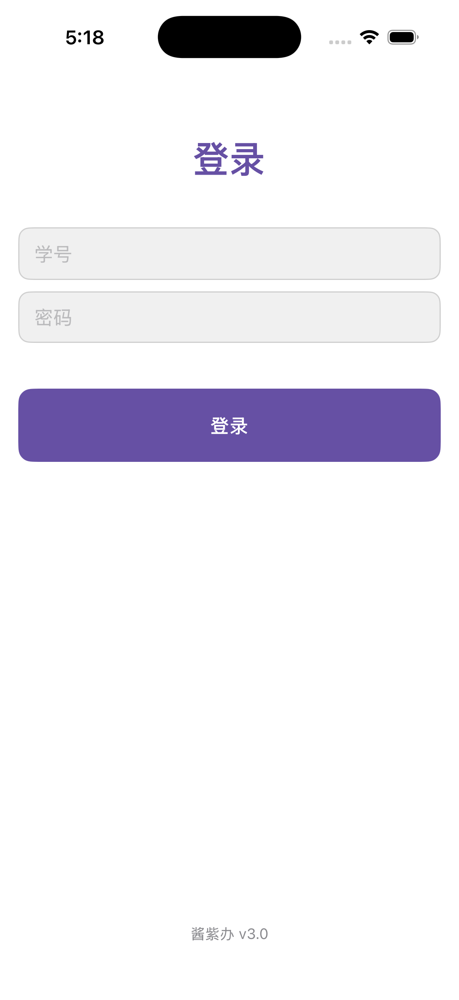
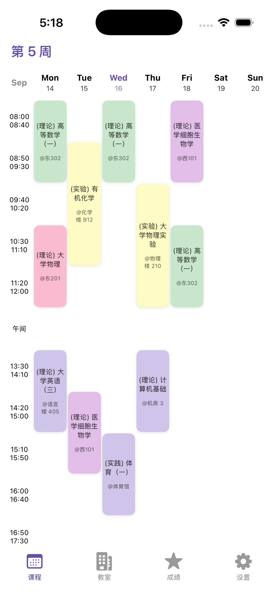
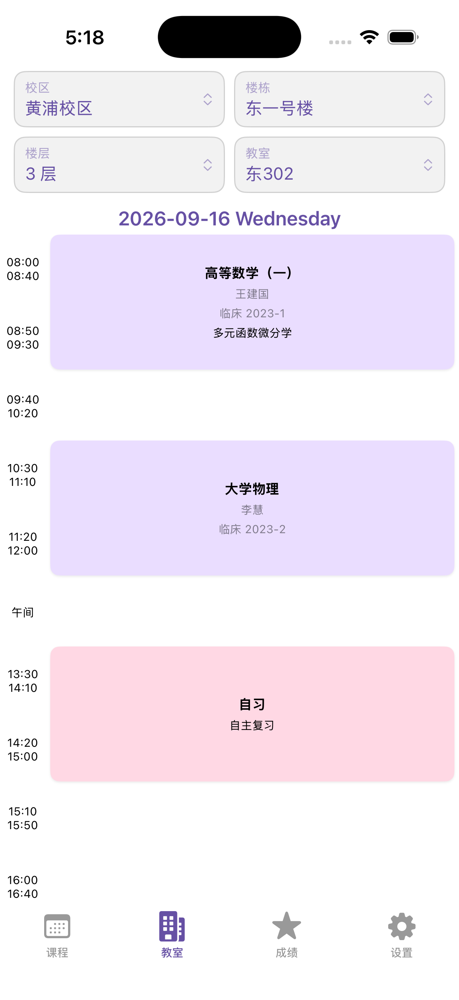
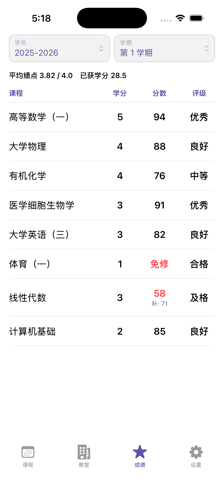
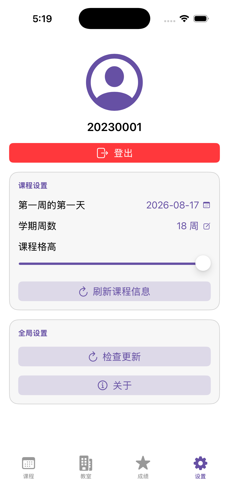

# 酱紫办 / MySHSMU — iOS 版

这是 [tototwoto/MySHSMU](https://github.com/tototwoto/MySHSMU)（Android / Kotlin / Jetpack Compose）的 iOS 移植，用 **SwiftUI + async/await** 重写，功能对齐原版：CAS 自动登录（含验证码识别）、课程表、教室占用查询、成绩查询、设置。

原项目的后端接口、加密方式、颜色算法等都被完整保留，**没有修改任何服务端协议**。

---

## 界面

下面是 App 在 iOS 模拟器里**真实运行**后截的图（iPhone 17 Pro / iOS 26.2），不是设计稿、不是渲染图。截图由 CI 自动完成，每次 push 都会重拍（见下方「验证状态」）。

| 登录 | 课程表 |
|---|---|
|  |  |

| 教室占用 | 成绩 |
|---|---|
|  |  |

| 设置 |
|---|
|  |

截图里是**虚构的演示数据** —— 一个 18 周的学期、一周 12 节课、含补考和免修的成绩单。它用来检验布局，不代表任何真实课表。

---

## ⚠️ 先读这一段：编译必须有 Mac

iOS 应用**只能**在 macOS + Xcode 上编译。这不是配置问题，是平台限制：

- iOS 模拟器是 Xcode 的一个组件，Windows 上不存在。
- ZCode 的 `ios-simulator` 插件在 `preflight` 里第一项检查就是 `process.platform === "darwin"`，还要求 `xcodebuild` / `xcrun` / `simctl` 全部可用 —— 在 Windows 上这四项检查都会失败。
- 没有合法的 Windows 编译 iOS 的方案。

如果你手边没有 Mac，有两条路：

| 方案 | 说明 |
|---|---|
| **GitHub Actions（推荐）** | 推到 GitHub，`.github/workflows/ios-build.yml` 会在 GitHub 的 macOS 机器上编译 + 跑单元测试。免费额度足够，不用买设备，但**不能**手动点开模拟器看界面。 |
| **租/买一台 Mac** | Mac mini M1 二手是性价比最高的选择；云端可选 MacinCloud、MacStadium、GitHub Codespaces 不支持 macOS。只有这样才能真正跑模拟器看效果。 |

---

## 目录结构

```
ios/
├── MySHSMU.xcodeproj/          ← 手写的工程文件，只含 App target，双击即可打开
├── project.yml                 ← XcodeGen 配置，生成「App + 小组件 + 测试」完整工程
├── MySHSMU/                    ← App 源码（44xx 行 Swift）
│   ├── App/                    ← @main 入口
│   ├── Core/                   ← 网络、Cookie、RSA、验证码、HTML 解析、日期、编码
│   ├── Models/                 ← 数据模型 + 根 UI 状态
│   ├── Service/                ← ShsmuService，教务接口封装
│   ├── ViewModel/              ← MainViewModel，业务逻辑
│   ├── UI/                     ← SwiftUI 界面（登录/课程/教室/成绩/设置）
│   └── Assets.xcassets/        ← 应用图标（由 Android 图标合成）、主题色
├── MySHSMUWidget/              ← WidgetKit 小组件（今日剩余课程）
├── MySHSMUTests/               ← 单元测试
└── .github/workflows/          ← macOS 云端编译 + 测试
```

---

## 装到真机上

模拟器构建和真机构建是两回事，**签名是唯一的门槛**：给真机签名要么需要 Mac 上的 Xcode，要么需要付费开发者账号。这里两条都不具备，所以 CI 只产出**未签名**的 `.ipa`，签名交给你自己机器上的侧载工具用你的 Apple ID 完成。

### 方式一：有 Mac（推荐，最省事）

```bash
open MySHSMU.xcodeproj
```

选中 `MySHSMU` scheme → 顶上设备选你的 iPhone → `⌘R`。Xcode 会让你登录 Apple ID 自动签名。

### 方式二：没有 Mac，用 Sideloadly（Windows）

1. 到 GitHub 仓库的 **Actions** → 最新一次 `iOS build` → 下载 **`MySHSMU-unsigned-ipa`** 工件，解压得到 `MySHSMU-unsigned.ipa`。

2. 在 Windows 上装 [Sideloadly](https://sideloadly.io/)。它需要 Apple 的驱动：去 apple.com 下载安装 **iTunes**（**不要**用 Microsoft Store 版本，那个不带驱动）。

3. iPhone 用数据线连电脑，手机上点「信任此电脑」。

4. 打开 Sideloadly：把 `MySHSMU-unsigned.ipa` 拖进去 → 填你的 Apple ID → Start。它会用你的免费账号重新签名并安装。

5. 手机上如果打不开，去 **设置 → 通用 → VPN 与设备管理**，信任你的开发者证书。

6. iOS 16 以上必须打开开发者模式：**设置 → 隐私与安全性 → 开发者模式** → 打开 → 重启手机。

### 方式三：付费开发者账号（$99/年）

有了账号就能用 TestFlight，装完 90 天不用管，也不用连电脑续期；小组件也能正常用（App Group 需要付费账号才能配置）。告诉我，我可以往 CI 里加一个上传 TestFlight 的任务。

### 免费账号的限制（务必知道）

| | 免费 Apple ID | 付费账号 |
|---|---|---|
| 有效期 | **7 天**，过期后 App 打不开 | 1 年 |
| 续期 | 重跑一次 Sideloadly | 无需 |
| 同时侧载 | 最多 3 个 App | — |
| App Group（小组件） | ❌ 不支持 | ✅ |

**7 天过期是硬限制**，不是这里的配置问题 —— 所有免费侧载都一样。过期后图标还在但点了闪退，重跑 Sideloadly 即可续上，数据不会丢。

### 这个 IPA 里没有什么

- **没有小组件**。它是用只含 App target 的 `MySHSMU.xcodeproj` 构建的。小组件需要 App Group，而免费 Apple ID 无法配置该能力，硬要嵌进去只会导致签名失败。
- **要求 iOS 17 或更高**。CI 里核实过：`minos 17.0`，`arm64` 单架构，无模拟器切片。

### 第一次打开会看到什么

登录页。填学号密码，点登录 —— App 会去拉验证码图片、用 Vision 在本地识别、算出结果再提交。识别错了会自动换一张重试，最多 5 次。

**但这条路径完全没有被验证过。** 上面的截图是用虚构数据拍的，真实的 CAS 登录一次都没跑过。如果登录失败，页面顶部会弹一条错误提示，把提示文字告诉我，我来定位。

---

## 验证状态

这段代码是在 Windows 上写的，本机没有 Swift 编译器。它靠 GitHub Actions 的 macOS 机器实际编译、运行并验证：

| 检查项 | 状态 |
|---|---|
| App target 编译（手写 `MySHSMU.xcodeproj`） | ✅ 通过 |
| App + Widget 编译（XcodeGen 生成的完整工程） | ✅ 通过 |
| 单元测试 | ✅ **59 个全部通过，0 失败** |
| 五屏界面在模拟器中真实渲染 | ✅ 见上方截图 |
| 课程表网格几何 | ✅ 用像素测量逐块核对过 |

运行环境：GitHub `macos-15` runner，Xcode 16，iOS 26.2 模拟器（iPhone 17 Pro）。每次 `git push` 自动重跑。

网格几何是这么核对的：把截图里的每个课程块做连通域分析，实测宽度 47.3pt（= 列宽 49.43 − 2pt 内缩）、高度精确等于 2.00 / 3.00 个时段（每时段 60pt）、列索引精确落在 0/1/2/3/4、纵向偏移全是 60pt 的整数倍。脚本是 `_grid_check.py`。

### 还没有验证的

**所有需要真实账号的路径都还没跑过。** 界面能显示不代表能登录：

- **登录流程**：没有用真实学号跑过 CAS 登录。WebVPN 跳转、表单提交、`login_box` 成功判定，全是未验证的。
- **验证码识别率**：Vision 在真实 CAS 验证码上的准确率未知 —— 这直接决定自动登录能不能成功。原版用 ML Kit，两个引擎表现会有差异。
- **`HTTPCookieStorage` 子类**：如果 URLSession 没有按预期调用我的覆写，登录态就无法跨启动保持。这是最需要真机验证的一环。即使失效，自动重登也能兜住，只是每次冷启动都要重新过验证码。
- **接口数据解析**：`getCurriculum` / `getScore` / 教室查询的 URL 拼接和字段解析都是照 Kotlin 源码逐字移植的，但**没有一个请求真正发出去过**。单元测试只覆盖了本地解析逻辑（用构造的 JSON），没覆盖线上返回的真实结构。
- **小组件**：编译过了，但没配置 App Group，也没在模拟器主屏上添加过。

拿到 Mac 或真实账号之后，第一件该做的事就是跑一遍登录。

---

## 怎么编译

### 方式一：直接打开手写工程（最快）

```bash
open MySHSMU.xcodeproj
```

选中 `MySHSMU` scheme → 选一台 iPhone 模拟器 → `⌘R`。

这个工程用手写的 `project.pbxproj`，用 Xcode 16 的 **文件系统同步目录组**（`PBXFileSystemSynchronizedRootGroup`），所以往 `MySHSMU/` 里加文件不需要改工程文件。需要 **Xcode 16 或更新版本**。

### 方式二：生成完整工程（含小组件和测试）

```bash
brew install xcodegen
xcodegen generate
open MySHSMUAll.xcodeproj
```

生成的 `MySHSMUAll.xcodeproj` 是手写工程的超集，多出 Widget 扩展和单元测试 target。两个工程用不同的名字，不会互相覆盖。

### 跑测试

```bash
xcodebuild test -project MySHSMUAll.xcodeproj -scheme MySHSMU \
  -destination 'platform=iOS Simulator,name=iPhone 16'
```

测试覆盖的是移植过程中最容易出错、又不需要真实账号就能验证的部分：

- **`WireEncodingTests`** — 表单/查询串编码必须和 OkHttp 逐字节一致。密码是 base64 的 RSA 密文，含 `+` `/` `=`，编码错一个字符服务端就拒绝登录。
- **`RsaCryptoTests`** — PEM → SPKI 解包 → PKCS#1 → `SecKey` → 加密，并用运行时生成的密钥对做加解密往返验证。
- **`CaptchaSolverTests`** — 验证码文本清洗与算式求值（`3x4=?` → `12`）。
- **`HtmlFormParserTests`** — CAS 登录表单解析：action 绝对化、字段顺序、跳过 submit、验证码图片 URL、注释/脚本干扰。
- **`URLGuardTests`** — 出站地址校验。
- **`CurriculumUtilsTests` / `AppCalendarTests`** — Java 字符串哈希（决定课程配色）、日期语义、周次计算。

### 云端编译（没有 Mac 时）

把 `ios/` 作为仓库根目录推上去，Actions 会自动：

1. 编译手写的 `MySHSMU.xcodeproj`
2. 用 XcodeGen 生成完整工程，编译 App + 小组件
3. 跑单元测试

如果 `ios/` 是子目录，把 workflow 移到仓库根并设置 `defaults.run.working-directory: ios`。

> ⚠️ 这个 workflow 里有个坑值得记一笔：最初的版本把 `xcodebuild` 通过管道接到 `tail` 上，于是整步的退出码来自 `tail` 而不是 `xcodebuild` —— 一个**编译失败**的运行被报成了绿色。现在改成写日志文件、单独 grep 错误、再原样传出 `xcodebuild` 的退出码。

---

## 移植对照表

| Android | iOS | 说明 |
|---|---|---|
| Kotlin + Jetpack Compose | Swift + SwiftUI | `@Observable` + `@MainActor` 替代 `StateFlow` + `viewModelScope` |
| Material 3 动态取色 | 固定紫色主题 | iOS 没有壁纸取色，用原版 `Color.kt` 里的 fallback 配色 |
| OkHttp + 自定义 `CookieJar` | `URLSession` + `HTTPCookieStorage` 子类 | 同样是按 host 做键、JSON 持久化 |
| Jsoup | `HtmlFormParser` | 自研轻量解析器，只解析登录表单需要的三项 |
| ML Kit 文字识别 | Vision `VNRecognizeTextRequest` | 都关掉语言纠正，避免把 `1+2=?` 当成句子 |
| `java.security` RSA | Security.framework `SecKeyCreateEncryptedData` | PKCS#1 v1.5 填充 |
| `SharedPreferences` | `UserDefaults` + Keychain | 密码改存 Keychain（原版是明文 SharedPreferences） |
| Glance 小组件 | WidgetKit 小组件 | 需要配置 App Group |
| `NavigationSuiteScaffold` | `TabView` | 四个标签页 |

### 刻意保留的细节

这些地方看起来可以「优化」，但改了就会和原版行为不一致，所以照搬了：

- **课程配色**用 Java 的 `String.hashCode()` 实现（`h = h*31 + c`，32 位回绕），不是 Swift 的 `hashValue`。Swift 的哈希每次进程启动都随机，用它的话课程颜色每次打开都会变。
- **URL 里的空查询参数标记**（`?vpn-12-o2-jwstu.shsmu.edu.cn`）没有等号，是这个 WebVPN 的约定，原样保留。
- **教室接口的参数拼写 `buliding`** 是后端写错的，必须跟着错。
- **课表时间段**（`08:00–08:40` 等 15 个时段）与 40 分钟匹配窗口完全照搬。
- **登录重试 5 次**，每次换一张验证码。

### 有意的改动

- 密码存 **Keychain** 而不是明文。
- **成绩查询的默认学年**由当前日期推导，原版硬编码 `"2025-2026"`，过了这个学年首次进入成绩页会先查错年份再纠正。
- 分页器范围有限（课程 ±260 周、教室 ±365 天），原版是 `Int.MAX_VALUE` 页；`TabView` 用不了无限页数，实际使用范围完全够。
- 所有出站请求先做一次地址校验：只允许 http/https，拒绝 localhost、环回、私有和保留地址。

---

## 已知限制

- **应用显示名**在工程文件里用 Xcode 的 `\U` 转义写成 `酱紫办`（`INFOPLIST_KEY_CFBundleDisplayName`）。如果主屏上显示的不是中文名，在 Xcode 里选中 target → General → Display Name 改一下即可。
- **「检查更新」指向 Android 版**。`update.json` 里是 APK 的下载地址和 `versionCode`。iOS 版的 `CURRENT_PROJECT_VERSION` 设成 30、`MARKETING_VERSION` 设成 3.0 与 Android 对齐，所以版本比较逻辑一致；点「立即更新」会在 Safari 里打开发布页，而不是安装新版本。
- **小组件默认不生效**。需要在 Xcode 里给 App 和 Widget 两个 target 都加上 App Group `group.xyz.reqwey.myshsmu` 能力。没配也能跑，`Preferences` 会自动回退到标准 `UserDefaults`（只是小组件读不到数据）。
- **Cookie 持久化依赖 `HTTPCookieStorage` 子类**。这是 Apple 文档标注可子类化的扩展点。如果登录状态无法跨启动保持，先检查这里；即使它失效，应用的自动重新登录也能兜住，只是每次冷启动都要重新过一次验证码。
- 应用图标是从 Android 的自适应图标（背景 + 前景两层）合成的 1024×1024，不是专业设计的 iOS 图标，没有 dark/tinted 变体。

## 维护脚本

仓库根目录下有三个 Python 检查脚本，是移植过程中用来替代编译器做静态校对的（已在 `.gitignore` 里）：

| 脚本 | 作用 |
|---|---|
| `_syntax_check.py` | 逐文件检查括号配平、顶层类型重名、统计行数 |
| `_symbol_check.py` | 交叉比对「引用的类型/成员」与「定义的」，找出漏写 |
| `_dup_check.py` | 找出同一签名被定义两次的成员（重构后最容易踩的坑） |
| `_pbxproj_check.py` | 校对手写工程文件：括号配平、UUID 有无悬空引用、是否纯 ASCII |

它们在校验阶段确实抓到过真实问题（一个重复的 `throwIfSessionExpired` 定义、一个会让 HTML 扫描器死循环的畸形标记）。有 Mac 之后就不需要了，`xcodebuild` 说得更准。

---

## 免责声明

本项目是第三方客户端，与上海交通大学医学院官方无关。请自行评估使用风险，妥善保管账号密码。
